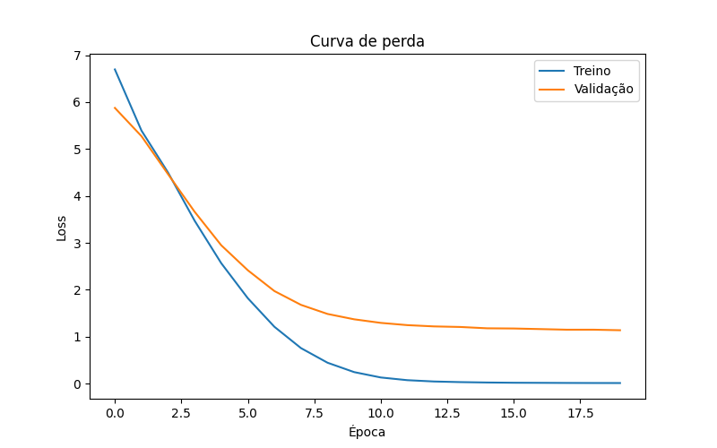
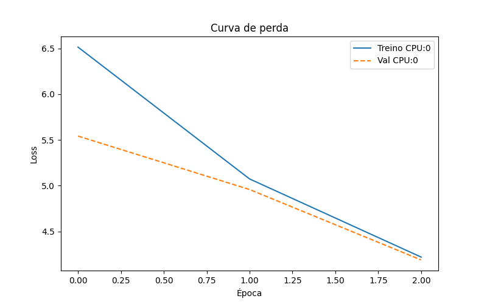

# Atividade Ponderada: Tradução usando Transformer com Controle de Versões

> **Observação:** Esta atividade foi desenvolvida como parte de um exercício ponderado e é baseada no tutorial oficial do TensorFlow: [Transformer Tutorial](https://www.tensorflow.org/text/tutorials/transformer).

---

## 1. Objetivo

&emsp;O objetivo desta atividade é implementar um modelo Transformer capaz de traduzir frases do português para o inglês. Ao desenvolver o modelo do zero, a aluna teve a oportunidade de aprofundar seu entendimento sobre a arquitetura Transformer e complementar os conhecimentos adquiridos durante o encontro com o professor.

## 2. Dataset utilizado 

&emsp;O dataset utilizado nesta atividade foi o "ted_hrlr_translate/pt_to_en", disponível no TensorFlow Datasets. Para uma abordagem inicial, foi feita uma amostragem de 2.000 dados de treino e 500 dados de validação.

---

## 3. Como Rodar

### Instalação

### 3.1 **Clonar o Repositório**  
&emsp;Copie o repositório para sua máquina local:  

```bash
   git clone <repo_url>
   cd transformer-pt-en
```

### 3.2 **Instalar dependências** 

&emsp;Principais dependências:

- **tensorflow** – para criar e treinar o modelo Transformer.

- **tensorflow-text** – para tokenização e pré-processamento de texto.

- **tensorflow-datasets** – para baixar o dataset ted_hrlr_translate/pt_to_en.

- **numpy** – para manipulação de arrays e cálculos numéricos.

- **matplotlib** – para plotar gráficos de treino (opcional).

```bash
pip install tensorflow 
pip install tensorflow_text 
pip install tensorflow_datasets 
pip install numpy 
pip install matplotlib.pyplot
```

&emsp;**Observação:** Se você tiver uma GPU, instale a versão compatível do TensorFlow com suporte a GPU:

```bash
pip install tensorflow-gpu
```

&emsp;Certifique-se de ter uma GPU disponível para que o treino seja mais rápido, embora seja possível rodar apenas na CPU.


### 3.3 Preparar os Dados

O dataset será carregado e pré-processado em batches com tokenização, truncamento e criação de tensores para treino e validação.

### 3.4 Treinar o Modelo

&emsp; Compile o modelo Transformer com a função de perda masked_loss e treine com Adam:

```bash
model.compile(optimizer=tf.keras.optimizers.Adam(), loss=masked_loss)

history = model.fit(
    train_batches_for_fit,
    validation_data=val_batches_for_fit,
    epochs=20
)
```

### 3.5 Testar Traduções

&emsp;Após o treino, traduza frases do português para inglês usando a função translate:

```bash
translation = translate("Olá, como você está?")
print(translation)
```

### 3.6 Treinar em Dispositivos Específicos (CPU/GPU)

&emsp; Para comparar desempenho, você pode treinar o modelo em dispositivos específicos:

```bash
duration, history = train_with_device('/GPU:0')  # GPU
duration, history = train_with_device('/CPU:0')  # CPU
print(f"Treinamento levou {duration:.2f} segundos")
```

## 4. Resultados

&emsp;Durante os experimentos, foi realizado o treinamento do Transformer tanto em CPU quanto em GPU para comparar o desempenho.

### Tabela de resultados CPU x GPU

| Epoch | CPU Loss | CPU Val_Loss | GPU Loss | GPU Val_Loss |
|-------|----------|--------------|----------|--------------|
| 1     | 0.0228   | 1.1445       | 0.0119   | 1.1314       |
| 2     | 0.0178   | 1.1787       | 0.0052   | 1.2205       |
| 3     | 0.0264   | 1.1945       | 0.0060   | 1.2709       |
| 4     | 0.0225   | 1.2311       | 0.0080   | 1.3217       |
| 5     | 0.0180   | 1.1967       | 0.0112   | 1.3102       |
| 6     | 0.0145   | 1.1696       | 0.0163   | 1.3380       |
| 7     | 0.0103   | 1.1662       | 0.0185   | 1.3556       |
| 8     | 0.0119   | 1.3013       | 0.0145   | 1.3072       |
| 9     | 0.0127   | 1.2809       | 0.0157   | 1.3460       |
| 10    | 0.0170   | 1.2489       | 0.0097   | 1.4506       |

**Tempo total de execução:**
- **CPU:** 1366.91s  
- **GPU:** 1393.01s  

&emsp;Curiosamente, apesar da GPU geralmente ser mais eficiente para esse tipo de arquitetura, os resultados mostraram tempos muito próximos: 1366s (CPU) vs 1393s (GPU) para 10 épocas. Isso pode estar relacionado ao tamanho reduzido do dataset utilizado, já que em cenários pequenos o overhead de comunicação com a GPU pode anular seus benefícios. Ainda assim, os resultados de loss e val_loss se mantiveram consistentes entre os dois ambientes, mostrando que o modelo aprendeu de forma semelhante independentemente do dispositivo.

&emsp;Em treinamentos de larga escala (datasets maiores, número maior de camadas ou épocas), é esperado que a GPU supere a CPU em eficiência, especialmente quando combinada com técnicas como mixed precision training.

## 5. Gráficos

&emsp;O treinamento do Transformer foi realizado por 20 épocas, registrando a evolução das perdas de treino e validação.

- Perda inicial (Época 1): loss = 7.45, val_loss = 5.87

- Perda final (Época 20): loss = 0.01, val_loss = 1.13

&emsp;Esse comportamento demonstra que o modelo conseguiu aprender os padrões do dataset, reduzindo significativamente o erro no treino. No entanto, observa-se uma diferença clara entre a perda de treino e validação, indicando sinais de overfitting a partir das últimas épocas.

<p align="center"><strong>Figura 1 - Curvas de perda</strong></p>

<p align="center"></p>

<p align="center"><strong>Fonte:</strong> Autoria própria.</p>

<p align="center"><strong>Figura 2 - Curvas de perda Comparativo</strong></p>

<p align="center"></p>

<p align="center"><strong>Fonte:</strong> Autoria própria.</p>

&emsp; De forma geral, o modelo convergiu rapidamente e apresentou bons resultados em treino, mas ainda há espaço para melhorias em generalização. Estratégias como aumento do dataset, regularização e ajuste de hiperparâmetros devem ser exploradas em trabalhos futuros.

## 6. Percepções Pessoais

&emsp; Durante o desenvolvimento deste projeto, algumas etapas se mostraram mais simples, enquanto outras exigiram maior atenção e ajustes cuidadosos.

- **Fácil:** A construção básica do Transformer usando TensorFlow foi relativamente tranquila, graças à clareza da API do Keras e aos exemplos disponíveis na documentação. O uso do tokenizador oficial do TensorFlow Datasets também facilitou bastante o pré-processamento das frases em português e inglês, permitindo gerar batches de forma prática e eficiente.

- **Difícil:** Um dos principais desafios foi ajustar corretamente as dimensões dos tensores, especialmente para embeddings, entradas do decoder e máscaras de atenção. Garantir que todos os tensores fossem compatíveis para operações como multi-head attention, adição residual e normalização exigiu atenção aos detalhes e alguns testes iterativos.

- **Trade-offs:** Durante a implementação, foi necessário equilibrar o tamanho dos batches com a memória disponível. Batches menores reduziram significativamente o uso de memória, permitindo rodar o modelo em máquinas com recursos limitados, mas também aumentaram o tempo total de treinamento. Encontrar esse equilíbrio foi fundamental para otimizar o desempenho sem comprometer a execução.

- **Gargalos:** Alguns pontos exigiram cuidado especial, como as operações de atenção em sequências longas, que podem ser computacionalmente custosas. A inicialização do decoder com o token de início (start token) também precisou de atenção para garantir a geração correta das traduções. Além disso, a compatibilidade entre diferentes tipos de inteiros (int32 e int64) nos tensores de entrada e saída foi outro desafio técnico que precisou ser resolvido para evitar erros durante o treino.

&emsp;No geral, o projeto proporcionou uma compreensão mais profunda do funcionamento interno do Transformer, reforçando conceitos de atenção, embeddings e treinamento de modelos de tradução de sequência para sequência.

## 7. Pontos Positivos e Negativos

### Pontos Positivos

- **Implementação funcional do Transformer:** O modelo foi construído do zero em TensorFlow, incluindo encoder, decoder e mecanismos de atenção, o que proporciona grande aprendizado sobre a arquitetura.

- **Treinamento bem-sucedido:** O modelo conseguiu convergir, reduzindo significativamente a perda de treino e alcançando perdas de validação em torno de 1.1, mostrando que a arquitetura está operando corretamente.

- **Base sólida para extensões futuras:** A implementação atual já permite experimentar melhorias como novos tokenizadores, ajustes de hiperparâmetros e técnicas de regularização.

### Pontos Negativos

- **Tutorial oficial**: O tutorial oficial do TensorFlow apresenta algumas falhas e, para que funcione corretamente, é necessário realizar diversos ajustes. Além disso, devido ao grande volume de dados e à quantidade de parâmetros utilizados, a execução pode levar mais de 10 horas quando não se dispõe de uma estrutura mais potente.

- **Gap entre treino e validação:** A perda de treino caiu quase a zero, enquanto a validação estabilizou em torno de 1.1–1.2, indicando overfitting.

- **Tempo de execução elevado:** Mesmo em GPU, o tempo por época ainda é relativamente alto devido ao tamanho das sequências e às operações de atenção, limitando a escalabilidade.

- **Dataset limitado:** A quantidade de dados utilizada não foi suficiente para explorar totalmente a capacidade do Transformer, o que pode restringir a qualidade final das traduções.

## 8. Principais Aprendizados

&emsp;Durante o desenvolvimento deste projeto, alguns aprendizados importantes se destacaram:

- **Entendimento da arquitetura Transformer:** A implementação do modelo do zero ajudou a consolidar os conceitos de encoder, decoder, embeddings e camadas de atenção.

- **Manipulação de tensores:** Ajustar corretamente dimensões e formatos de tensores foi essencial para o funcionamento do modelo, principalmente na integração entre embedding, atenção e saída do decoder.

- **Importância do pré-processamento:** O uso do tokenizador oficial do TensorFlow Text simplificou a preparação dos dados, mostrando a relevância de uma tokenização adequada para bons resultados.

- **Treinamento em GPU vs CPU:** A comparação de desempenho mostrou a vantagem de usar GPUs em tarefas intensivas como o treino de Transformers, além da possibilidade de otimizações com técnicas como mixed precision.

- **Avaliação prática do modelo:** Criar uma função de tradução manual deixou claro como o processo de geração é feito token por token e a importância de estratégias de decodificação mais elaboradas.

## 9. Próximos Passos

&emsp; Para aprimorar este projeto, algumas estratégias e melhorias podem ser exploradas:

- **Avaliar tokenizadores mais avançados:** Explorar alternativas como KerasNLP ou SentencePiece pode gerar representações de texto mais eficientes, melhorar a cobertura de vocabulário e reduzir o problema de tokens desconhecidos.

- **Aumentar o dataset:** Utilizar um conjunto de dados maior pode melhorar a capacidade do modelo de generalizar, resultando em traduções mais precisas e robustas, especialmente para frases mais longas ou complexas.

- **Usar mixed precision:** Habilitar treino com precisão mista (mixed precision) pode acelerar significativamente o treinamento em GPUs modernas, reduzindo o uso de memória sem comprometer a precisão do modelo.

- **Ajustar e testar hiperparâmetros:** Explorar diferentes valores para d_model, num_heads e dff permite avaliar combinações que melhorem a performance do modelo. Testar outros hiperparâmetros como taxa de aprendizado, tamanho de batch e número de camadas também é importante para otimização.

- **Implementar beam search no decoder:** A geração de traduções pode se tornar mais coerente e natural utilizando estratégias de decodificação mais sofisticadas, como beam search, em vez de apenas selecionar o token de maior probabilidade.

- **Visualizar mapas de atenção detalhados:** Criar visualizações de atenção por camada ajuda a entender quais palavras o modelo está focando em cada etapa da tradução, fornecendo insights valiosos sobre o comportamento interno do Transformer.

- **Automatizar salvamento de gráficos:** Gerar automaticamente gráficos de perda e mapas de atenção em arquivos .png facilita a análise de experimentos e a documentação dos resultados de forma organizada.

&emsp;Esses próximos passos permitem não apenas melhorar a performance e a precisão do modelo, mas também tornar o projeto mais completo, visualmente intuitivo e fácil de analisar.

## 10. Conclusão

&emsp;A construção deste Transformer para tradução de português para inglês permitiu compreender de forma prática como os modelos de atenção funcionam e quais são os principais desafios de sua implementação. Apesar das dificuldades iniciais com ajustes de dimensões e configurações de camadas, o modelo conseguiu traduzir sentenças simples, evidenciando o potencial da arquitetura.

&emsp;O projeto serve como uma base sólida para evoluções futuras, como o uso de datasets maiores, tokenizadores mais robustos e ajustes de hiperparâmetros. Com esses aprimoramentos, o modelo pode alcançar resultados mais próximos de aplicações reais de tradução automática.

&emsp;Por fim, ressalta-se que, apesar de todo o esforço da aluna em obter bons resultados, ainda há espaço significativo para melhorias, tanto no desempenho quanto na capacidade de generalização do modelo.
